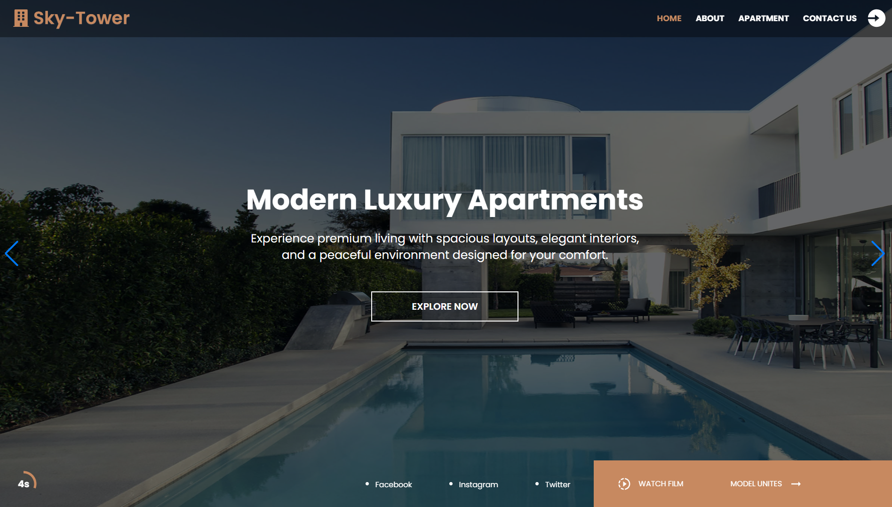
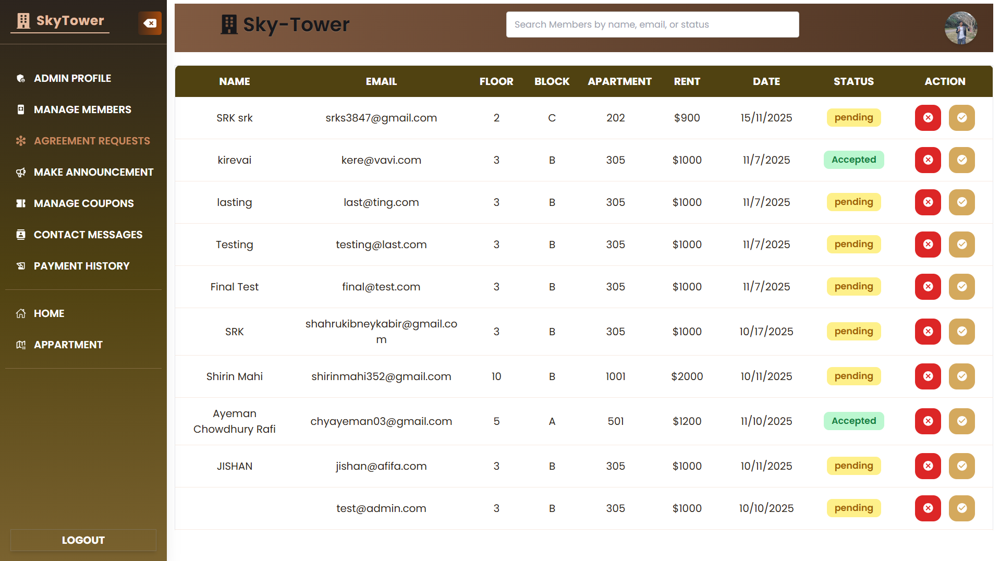
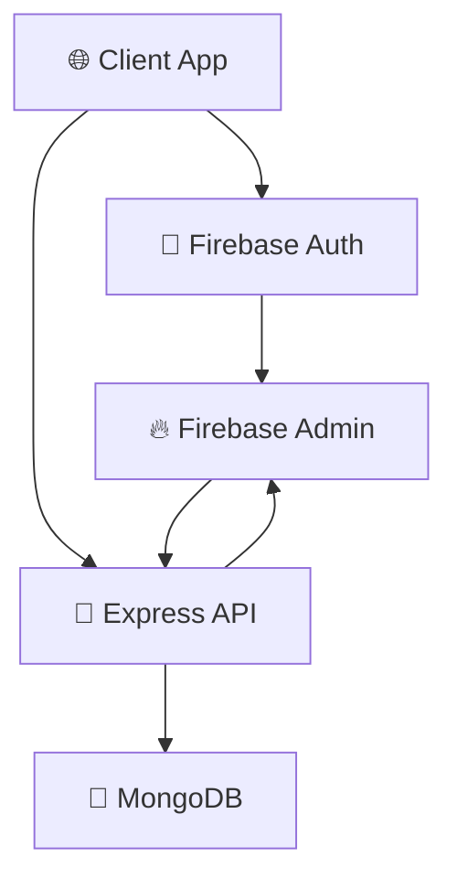

<div align="center">

# 🏢 SkyTower – Building Management System

**A modern, fully-featured platform for managing a residential building — built for users, members, and administrators.**

_Efficient apartment booking, digital payments, announcements, agreement management, and complete building operations in one place._

[](https://srk-skytower.web.app/)
[](https://react.dev/)
[](https://vitejs.dev/)
[](https://tailwindcss.com/)
[](https://daisyui.com/)
[](https://firebase.google.com/)
[](https://mongodb.com/)
[](https://expressjs.com/)
[](https://tanstack.com/query/latest/)
[](https://vercel.com/)


</div>

---

## 📖 About SkyTower

SkyTower is a single-building management system designed to simplify the experience for users, building members, and administrators. The platform provides apartment booking, agreement requests, secure payments, coupon usage, messaging, member management, admin dashboards, analytics, and much more — all within a modern, responsive UI.

---

## 🖼️ Screenshots

<table>
  <tr>
    <td align="center"><b>Homepage Banner</b></td>
    <td align="center"><b>Dashboard Sample</b></td>
  </tr>
  <tr>
    <td></td>
    <td></td>
  </tr>
</table>

---

## ✨ Key Features

## 🛡️ Role-Based Access Control  
   Separate dashboards for Admin, User, and Member

---

## 👑 Admin Dashboard  
- Manage building members 👥  
- Approve or reject agreement requests ✔️✖️  
- Create, update, enable, or disable coupons 🎫  
- Publish official announcements 📣  
- Remove members or change their roles 🔧  
- View building statistics, room availability & analytics 📊  
- Monitor pending agreements and update statuses 📝  

---

## 🧑‍🤝‍🧑 Member Dashboard  
- View rented apartment details 🏡  
- Make monthly rent payments online 💳  
- Apply discount coupons at checkout 🎟️  
- View complete payment history 📄  
- See building announcements instantly 📢  

---

## 👤 User Dashboard  
- View personal profile details 🧑  
- Submit apartment agreement requests 📝  
- Explore available apartments with details & photos 🏘️  
- Search apartments by rent range 🔍  
- View announcements posted by the admin 📣  

---

### 🔐 Authentication  
- Secure email/password login 🔑  
- Google Sign-In support 🟦  
- JWT authentication for all protected routes 🛡️  
- Login persistence across page reloads ♻️  

---

### 🏘️ Apartment Management  
- View all apartments with floor, block, and rent details 🧾  
- Beautiful photo previews of each apartment 🏠  
- Agreement request saved automatically to database 💾  
- Pagination for smooth navigation ⬅️➡️  

---

### 💸 Rent Payment System  
- Seamless online rent payment 💳  
- Apply coupons for instant discounts 🎟️  
- Payment confirmation and updates via alerts ⚡  
- All payment records stored in database 📝  

---

### 🛎️ Announcement System  
- Admin can publish building-wide announcements 📣  
- Users & members see live updates instantly ⚡  

---

### 🎉 Alerts & Notifications  
- Beautiful success/error popups using **SweetAlert2** ✨  
- Clean, minimal notifications using **React Hot Toast** 🔔  
- Used across login, payment, CRUD operations, and more ✔️  

---

### 🚀 Performance & Modern Tools  
- TanStack Query for optimized data fetching ⚡  
- Axios with secure API requests 🔐  
- Fully responsive design for mobile, tablet, and desktop 📱  
- Tailwind CSS + DaisyUI for a smooth, modern theme 🎨  


---

## 🌐 Live Demo

**🚀 Try SkyTower:**  
[https://srk-skytower.web.app/](https://srk-skytower.web.app/)

**🛠️ Server Repository:**  
🔗 https://github.com/shahrukkabir/skytower-bms-server

**Admin Credentials:**  
📧 `skytower@admin.com`  
🔑 `Skytower.admin`

---


## 🛠️ **Technology Stack**

### 🎨 **Frontend**
| Technology | Version | Purpose |
|------------|---------|---------|
| **React** | `19.1.0` | Modern UI library with latest features |
| **Vite** | `6.3.5` | Lightning-fast build tool and dev server |
| **React Router** | `7.6.2` | Client-side routing with data loading |
| **Tailwind CSS** | `4.1.8` | Utility-first CSS framework |
| **DaisyUI** | `5.0.43` | Beautiful component library |
| **Framer Motion** | `12.16.0` | Smooth animations and transitions |

### ⚙️ **Backend**
| Technology | Version | Purpose |
|------------|---------|---------|
| **Node.js** | `Latest` | JavaScript runtime environment |
| **Express** | `5.1.0` | Web application framework |
| **MongoDB** | `6.17.0` | NoSQL database for data storage |
| **Firebase Admin** | `13.4.0` | Authentication and user management |

### 🔧 **Development Tools**
- **ESLint** - Code linting and quality
- **Axios** - HTTP client for API calls
- **CORS** - Cross-origin resource sharing
- **dotenv** - Environment variable management

---

## ⚡ **Quick Start**

### 📋 **Prerequisites**
- **Node.js** (v18 or higher)
- **npm** or **yarn**
- **MongoDB** database
- **Firebase** project setup

### 🚀 **Installation**

#### **1. Clone the Repository**
```bash
git clone https://github.com/shahrukkabir/skytower-bms.git
cd skytower-bms
```

#### **2. Install Dependencies**
```bash
npm install
```

#### **3. Environment Configuration**

**Client (`.env.local`):**
```env
VITE_FIREBASE_API_KEY=your_firebase_api_key
VITE_FIREBASE_AUTH_DOMAIN=your_project.firebaseapp.com
VITE_FIREBASE_PROJECT_ID=your_project_id
VITE_FIREBASE_STORAGE_BUCKET=your_project.appspot.com
VITE_FIREBASE_MESSAGING_SENDER_ID=your_sender_id
VITE_FIREBASE_APP_ID=your_app_id
```

#### **4. Run the Applications**

**Start the Server:**
```bash
cd skytower-bms-server
npm start
```

**5. Start the Client:**
```bash
cd skytower-bms
npm run dev
```

🎉 **Visit** [http://localhost:5173](http://localhost:5173) **to see skytower-bms in action!**

---

## 📁 **Project Architecture**

### 🏗️ **Client Structure**
```
SkyTower-BMS/
├── src/
│   ├── Layout/                 # Main layout + Dashboard layout
│   ├── Pages/
│   │   ├── Home/               # Banner, Features, Overview, etc.
│   │   ├── Apartments/         # Apartment list + agreement
│   │   ├── Auth/               # Login & Register
│   │   ├── Dashboard/          # Admin, Member & User dashboards
│   │   ├── Announcement/       # Announcements page
│   │   └── Contact/            # Contact page
│   │
│   ├── Shared/                 # Navbar, Footer, Protected Routes
│   ├── provider/               # AuthProvider (user, token, role)
│   ├── hooks/                  # useAuth, useAxiosSecure, etc.
│   ├── App.jsx                 # Main application component
│   └── main.jsx                # Entry point
│
├── .env.local                  # Environment variables
├── package.json                # Dependencies
└── README.md                   # Documentation

```

### 🔄 **Data Flow**

---

## 🚀 Deployment

1. **Install Firebase CLI:**
   ```bash
   npm install -g firebase-tools
   ```
2. **Login to Firebase:**
   ```bash
   firebase login
   ```
3. **Deploy to Firebase Hosting:**
   ```bash
   firebase deploy
   ```

---

## 📞 **Contact & Connect**

<div align="center">

### 👨‍💻 **Developer Information**

**Shahruk Ibney Kabir**  
*Full-Stack Developer & SkyTower Creator*

[](https://www.linkedin.com/in/shahrukkabir/)
[](mailto:shahrukkabir01@gmail.com)


### 🌟 **Project Links**

[](https://srk-skytower.web.app/)
[](https://github.com/shahrukkabir/skytower-bms-server)

</div>

---

## 🙏 **Acknowledgments**

Special thanks to the amazing open-source community and these incredible technologies:

### 🚀 **Core Technologies**
- [**React**](https://react.dev/) - The library for web and native user interfaces
- [**Vite**](https://vitejs.dev/) - Next generation frontend tooling
- [**Node.js**](https://nodejs.org/) - JavaScript runtime built on Chrome's V8 engine
- [**Express**](https://expressjs.com/) - Fast, unopinionated, minimalist web framework
- [**MongoDB**](https://mongodb.com/) - The developer data platform

### 🎨 **UI & Design**
- [**Tailwind CSS**](https://tailwindcss.com/) - Utility-first CSS framework
- [**DaisyUI**](https://daisyui.com/) - The most popular component library for Tailwind CSS
- [**Framer Motion**](https://www.framer.com/motion/) - Production-ready motion library for React
- [**Lottie**](https://lottiefiles.com/) - Lightweight, scalable animations
- [**React Icons**](https://react-icons.github.io/react-icons/) - Popular icon libraries

### 🔧 **Development Tools**
- [**Firebase**](https://firebase.google.com/) - Google's mobile and web application development platform
- [**Vercel**](https://vercel.com/) - Platform for frontend frameworks and static sites
- [**SweetAlert2**](https://sweetalert2.github.io/) - Beautiful, responsive, customizable replacement for alert()
- [**React Hot Toast**](https://react-hot-toast.com/) - Smoking hot React notifications

---

<div align="center">

### 🌟 **Show Your Support**

If SkyTower helped you or you found it interesting, please consider:

⭐ **Starring** this repository  
🐛 **Reporting** issues  
💡 **Suggesting** new features  
🤝 **Contributing** to the project  
📢 **Sharing** with others  

**Built with ❤️ by [Shahruk Ibney Kabir](https://www.linkedin.com/in/shahrukkabir/)**

*SkyTower – Where Convenience Meets Modern Living* 🏠✨

</div>